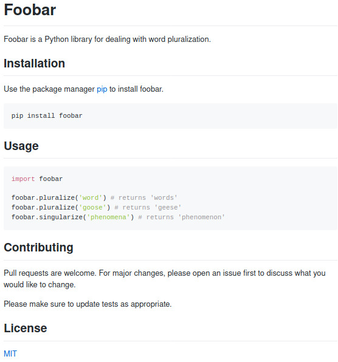

# Foobar
Foobar is a Python library for dealing with word pluralization. 
# Installation 

Use the package manager [pip](https://github.com/AhmedFawzyMetwaly) to install foobar. 
```
pip install foobar
```
# Usage 
```javascript
Import foobar 
foobar.pluralize,word, a returns 'words' foobar.pluralize,goose, returns 'geese' 
foobar.singularize,henomena, returns 'phenomenon' 
```
# Contributing 
Pull requests are welcome. For major changes, please open an issue first to discuss what you would like to change. 
Please make sure to update tests as appropriate. 
# License 
[MIT](https://opensource.org/licenses/MIT)

# Image

